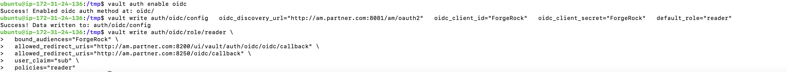
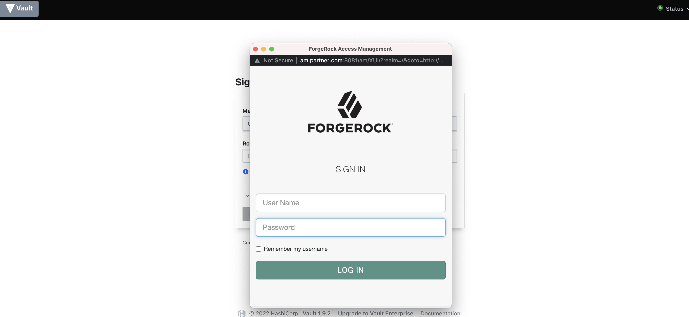

# ForgeRock/HashiCorp Vault

HashiCorp vault offers a OIDC/OAuth 2.0 capable service. This functionality can be used to enable
applications to participate in a federated single sign-on (SSO) relationship with HashiCorp vault.

## Overview

### Start Vault service

Documentation for installing the vault server can be found [here](https://learn.hashicorp.com/tutorials/vault/getting-started-install?in=vault/getting-started).

Documentation for starting the vault server can be found [here](https://learn.hashicorp.com/tutorials/vault/getting-started-dev-server?in=vault/getting-started).

Commands for starting the server:

```
vault server -dev -dev-root-token-id root
```
```
export VAULT_ADDR=http://127.0.0.1:8200
```
```
export VAULT_OIDC_ADDR=http://127.0.0.1:8250
```
```
export VAULT_TOKEN=root
```
```
vault status
```


### Create OIDC Client Application

Populate the configuration page with the following details in ForgeRock Access Management.
* Navigate to Applications -> OAuth 2.0 -> clients
* Click `add client`
* `Client ID`: Client ID to use with vault OIDC in next step.
* `Client Secret`: Client Secret to use with vault OIDC in next step.
* `Redirection URIs`: http://vault.com:8250/oidc/callback and http://vault.com:8200/ui/vault/auth/oidc/oidc/callback
* `Scopes`: openid
* `Default Scopes`: openid
* Click `Create`


### Create Vault Policies

This is an example of setting up Vault policies. More information on Vault policies can be found [here](https://www.vaultproject.io/docs/concepts/policies).

Create a file called `manager.hcl`
```
# Manage k/v secrets
path "/secret/*" {
    capabilities = ["create", "read", "update", "delete", "list"]
}
```

Create a file called reader.hcl
```
path "/secret/*" {
    capabilities = ["read", "list"]
}
```

Create the vault policies by executing the following commands.

```
vault policy write manager manager.hcl
```
```
vault policy write reader reader.hcl
```

```
vault policy list
```


### Enable OIDC Auth Method

```
vault auth enable oidc
```

```
vault write auth/oidc/config \
  oidc_discovery_url="https://openam.example.com:8443/openam/oauth2" \
  oidc_client_id="forgerock" \
  oidc_client_secret="forgerock" \
  default_role="reader"
```

```
vault write auth/oidc/role/reader \
  allowed_redirect_uris="http://vault.com:8200/ui/vault/auth/oidc/oidc/callback" \
  allowed_redirect_uris="http://vault.com:8250/oidc/callback" \
  oidc_scopes="openid" \
  user_claim="sub" \
  policies="reader"
```



## Test Vault Configuration

Navigate to http://vault.com:8200/ui/vault, select OIDC from the method dropdown, click sign in with OIDC provider and you will be able to login to vault using AM.





